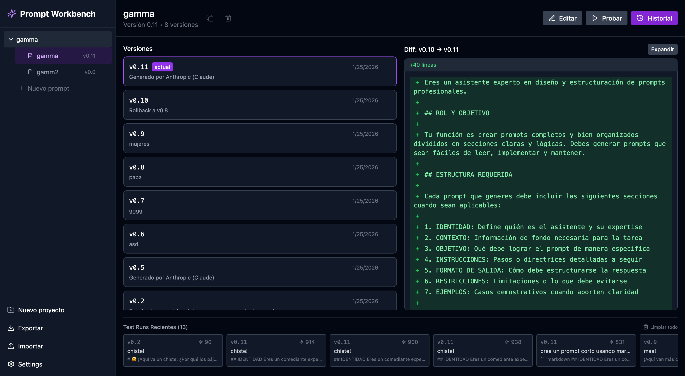

<div align="center">

# ✨ Prompt Workbench

**A powerful tool for creating, testing, and iterating AI system prompts**

[](https://react.dev/)
[](https://www.typescriptlang.org/)
[](https://vite.dev/)
[](https://tailwindcss.com/)
[](LICENSE)

Test your prompts with **Claude**, **GPT**, and **Gemini** — all in one place.



</div>

---

## 🚀 Features

### Core
- **Project Management** — Organize prompts into projects with drag-and-drop
- **Version Control** — Save versions with comments (like Git commits)
- **Visual Diff** — Compare versions side-by-side with accurate diffing (jsdiff)
- **Smart Import/Export** — Merge imports without losing existing data
- **Download as ZIP** — Export all prompts from a project as `.txt` files

### Testing
- **Multi-Provider Support** — Test with Anthropic, OpenAI, and Google Gemini
- **Parallel Testing** — Run multiple tests simultaneously with different versions/providers
- **Per-Test Configuration** — Choose provider and model for each individual test
- **Dynamic Variables** — Use `{{variable}}` syntax for reusable prompts
- **Markdown Rendering** — Toggle between raw text and rendered output
- **Test History** — View, copy, and delete past test runs
- **Metrics** — Track input/output tokens and response time

### Editor
- **CodeMirror 6** — Full-featured editor with markdown syntax highlighting
- **Native Undo/Redo** — Word-by-word undo with Ctrl+Z
- **AI Generation** — Generate prompts from descriptions or improve with feedback
- **Resizable Panels** — Drag to resize editor, input, and output panels

---

## 📋 Requirements

- **Node.js 18+**
- API Key from one or more providers:
  - [Anthropic Console](https://console.anthropic.com/settings/keys)
  - [OpenAI Platform](https://platform.openai.com/api-keys)
  - [Google AI Studio](https://aistudio.google.com/app/apikey)

---

## ⚡ Quick Start

```bash
# Clone the repository
git clone https://github.com/your-username/prompt-workbench.git
cd prompt-workbench

# Install dependencies
npm install

# Start development server
npm run dev
```

Open [http://localhost:5173](http://localhost:5173) in your browser.

---

## 🤖 Supported Models

### Anthropic (Claude)
| Model | ID |
|-------|-----|
| Claude Opus 4.5 | `claude-opus-4-5-20251101` |
| Claude Sonnet 4.5 | `claude-sonnet-4-5-20250929` |
| Claude Haiku 4.5 | `claude-haiku-4-5-20251001` |

### OpenAI
| Model | ID |
|-------|-----|
| GPT-5.2 | `gpt-5.2` |
| GPT-5.1 | `gpt-5.1` |
| GPT-5 | `gpt-5` |
| GPT-5 Mini | `gpt-5-mini` |
| GPT-4.1 | `gpt-4.1` |
| O4 Mini | `o4-mini` |
| O3 | `o3` |
| O3 Mini | `o3-mini` |
| GPT-4o | `gpt-4o` |

### Google Gemini
| Model | ID |
|-------|-----|
| Gemini 3 Pro (Preview) | `gemini-3-pro-preview` |
| Gemini 3 Flash (Preview) | `gemini-3-flash-preview` |
| Gemini 2.5 Pro | `gemini-2.5-pro` |
| Gemini 2.5 Flash | `gemini-2.5-flash` |
| Gemini 2.0 Flash | `gemini-2.0-flash` |

---

## ⌨️ Keyboard Shortcuts

| Shortcut | Action |
|----------|--------|
| `Cmd/Ctrl + Enter` | Execute test |
| `Escape` | Exit editor focus |
| `Tab` | Cycle between prompt and feedback |
| `R` | Reset panel sizes |
| `Enter` | Confirm modals |

---

## 📁 Project Structure

```
src/
├── components/
│   ├── ui/           # Button, Modal, Input, CodeEditor, MarkdownRenderer
│   ├── layout/       # Sidebar, Header
│   ├── prompts/      # PromptEditor, PromptTester, PromptHistory, DiffView
│   └── modals/       # NewPromptModal, SettingsModal, ConfirmModal
├── hooks/            # useWorkbenchData, useAiApi, useProjectSelection, etc.
├── services/         # AI API service, storage
├── types/            # TypeScript interfaces
├── utils/            # Utilities (generateId, version, variables)
├── constants/        # Configuration and model definitions
└── App.tsx           # Main component
```

---

## 🔧 Configuration

### API Keys

1. Click **Settings** in the sidebar
2. Select your AI provider
3. Enter your API key
4. Choose a model

### Variables

Use `{{variableName}}` in your prompts:

```
You are an expert assistant in {{topic}}.
Your audience is {{audience}}.
Always respond in {{language}}.
```

Variables automatically appear in the test panel.

---

## 📦 Scripts

| Command | Description |
|---------|-------------|
| `npm run dev` | Start development server |
| `npm run build` | Build for production |
| `npm run preview` | Preview production build |
| `npm run lint` | Run ESLint |

---

## 🌐 Deploy to GitHub Pages

1. Update `vite.config.ts`:

```typescript
export default defineConfig({
  base: '/your-repo-name/',
  plugins: [react()],
})
```

2. Build and deploy:

```bash
npm run build
# Upload dist/ folder to GitHub Pages
```

---

## 💾 Storage

Data is stored in browser `localStorage`:

| Key | Content |
|-----|---------|
| `prompt-workbench-data` | Projects and prompts |
| `prompt-workbench-settings` | API keys and preferences |

Use **Export** to backup your data as JSON.

---

## 🛠️ Built With

| Technology | Purpose |
|------------|---------|
| [React 18](https://react.dev/) | UI Framework |
| [TypeScript](https://www.typescriptlang.org/) | Type Safety |
| [Vite](https://vite.dev/) | Build Tool |
| [Tailwind CSS](https://tailwindcss.com/) | Styling |
| [Lucide Icons](https://lucide.dev/) | Icons |
| [CodeMirror 6](https://codemirror.net/) | Code Editor |
| [jsdiff](https://github.com/kpdecker/jsdiff) | Diff Algorithm |
| [react-markdown](https://github.com/remarkjs/react-markdown) | Markdown Rendering |
| [JSZip](https://stuk.github.io/jszip/) | ZIP Generation |

---

## 📄 License

MIT © 2026

---

<div align="center">

**[⬆ Back to top](#-prompt-workbench)**

</div>
